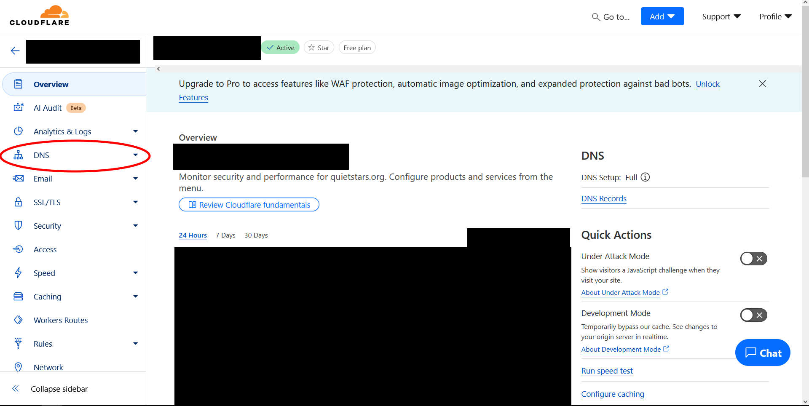

to-do:
- Add RTC protocol thing for Databag.
- (Sengachi) I'm pretty sure the current configuration I use leaves traffic readable by Cloudflare. Check if there's a way around this other than getting both parties to go through the hassle of Tailscale.
  - Also add a Tailscale tutorial, but that's not an immediate priority. 
- We might also need to change the Zero Trust instructions for dietpi with Secure Communications Only.

# __Getting a Web URL with Cloudflare__

This section will show you how to get a web domain and sign up for Cloudflare, a company which provides (among other things) web traffic routing services. As of 2025, Cloudflare's services cost about $10/yr. This section may be harder to understand if you're unfamiliar with internet backend terminology, but it's not technically complicated. In essence, you're filling out paperwork.

This paperwork makes it so that when someone types your Hearth Box's **Web URL** into a browser, the request to see that website gets securely redirected to the server hosted on your Raspberry Pi.

## __Purchasing a URL__

Note: Updates to Cloudflare's website may cause its user interface or layout to differ from its depiction in the following images. If this is the case, please leave a note in the `Issues` tab of the Locus Server's Github repository.

1. Go to [IPchicken](https://ipchicken.com/) to find your router's **global IP address**. It should be of the form **XXX.XXX.XXX.XXX**, where each **XXX** can be 1, 2, or 3 digits. This is the mailbox for your piece of the internet. **Write this down.** It will be used in this section and future sections.

2. Go to [Cloudflare's website](https://www.cloudflare.com/). We recommend bookmarking this website in case you ever need to manage your account in the future. Click the `Sign Up` button to make an account. Select the `Free` option.

**Note:** "Free" means that you are opting to not pay for Cloudflare support and extra features. Businesses need these features, but you do not. You *will* still have to pay for the web domain you will be using.

3. Once you have an account, go to your [Cloudflare dashboard](https://dash.cloudflare.com). You should be at `Account Home`. If not, click that tab on the left. Click `Add A New Domain`, then `Or register a new domain ->`. Enter your desired URL into the search bar to see if it's available. We recommend selecting a **.org** or **.com** address, as these are open to anyone to register. `Confirm` your desired URL and purchase it. 

   

**Warning:** Ensure that you always renew your URL before your payment period ends for as long as you intend to continue using the server. If you do not renew your URL before your payment period is finished, then you will lose the URL. If you are using this for secure communication, that is a security risk, as someone else could take the URL and pretend to be your secure server.

4. Return to Cloudflare's `Account Home`. Click your chosen URL under `Domain`. Click the `DNS` (Domain Name System) tab on the left, then click `Add A Record`. You may have to scroll down to find `Add A Record`. Make sure the `Type` field is **A**, the `Name` field is **@**, and the `Proxy Status` switch is set to **Proxied**. Enter the **global IP address** you found in Step 1 into the `IPv4 address` field. Then click `Save`. You now have an internet record which lets computers find your device by using your chosen URL.

   

**Caution**: If you move your equipment so that it is connected to a different internet router (if you move apartments, for example), your **global IP address** will change. Repeat Step 1 to find your new **global IP address**, then change the `IPv4 address` field in this step to that new value.

You will need to access [Cloudflare's website](https://www.cloudflare.com/) for a later part of the process, so leave this webpage open in the background for now. Your next step will be to [image an operating system onto your Raspberry Pi](../Instructions/Raspberry_Pi_Image_Decision.md).

