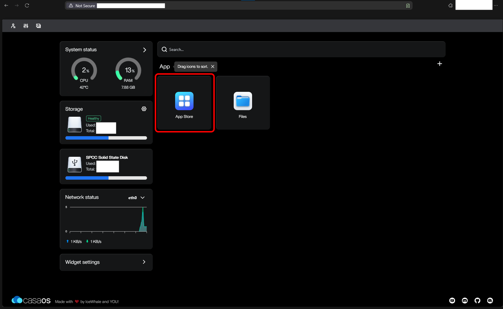
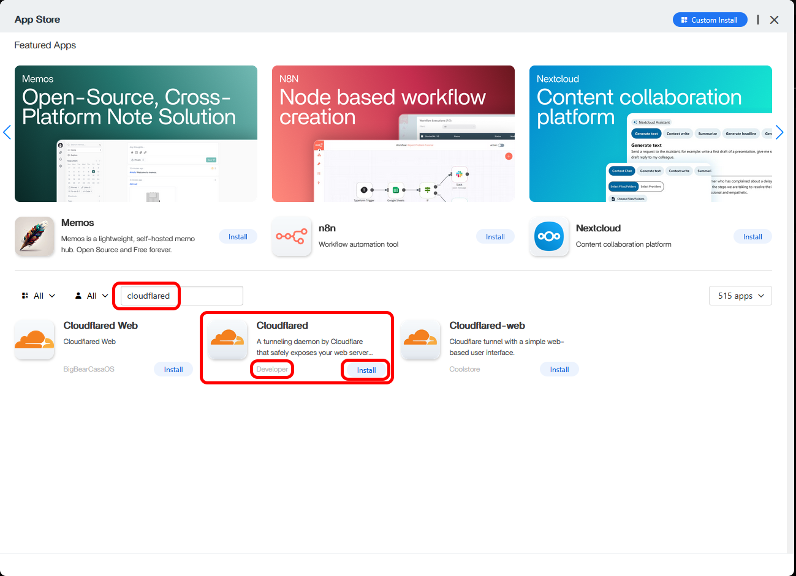
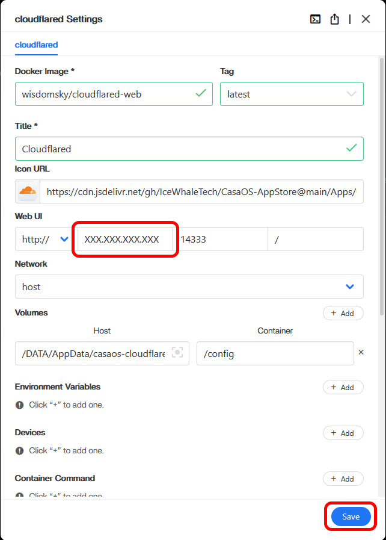
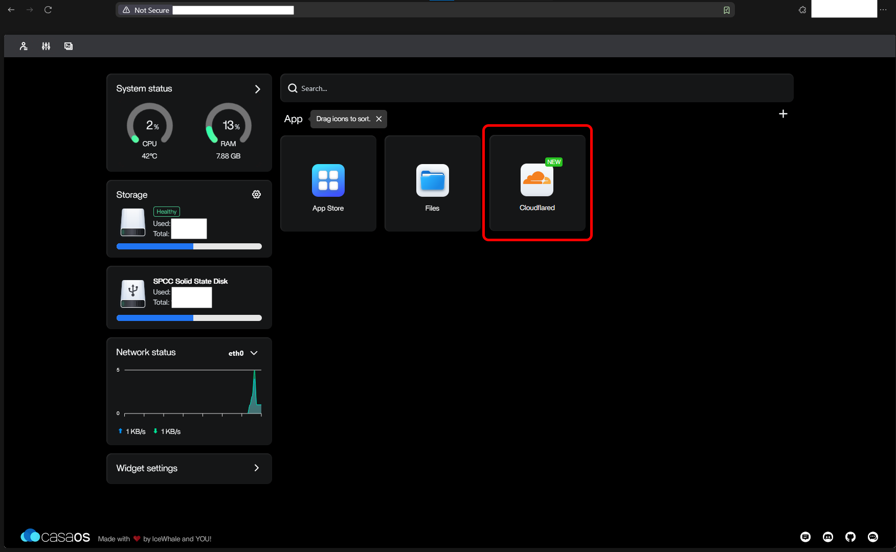
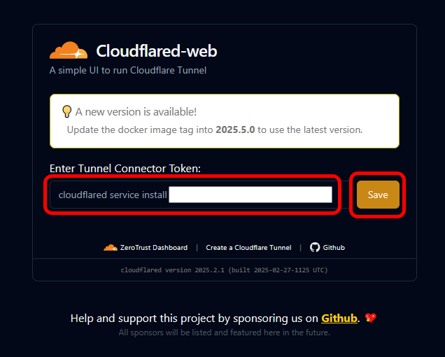
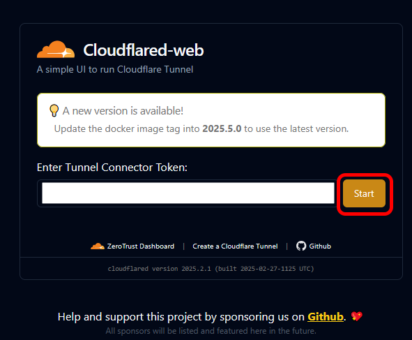
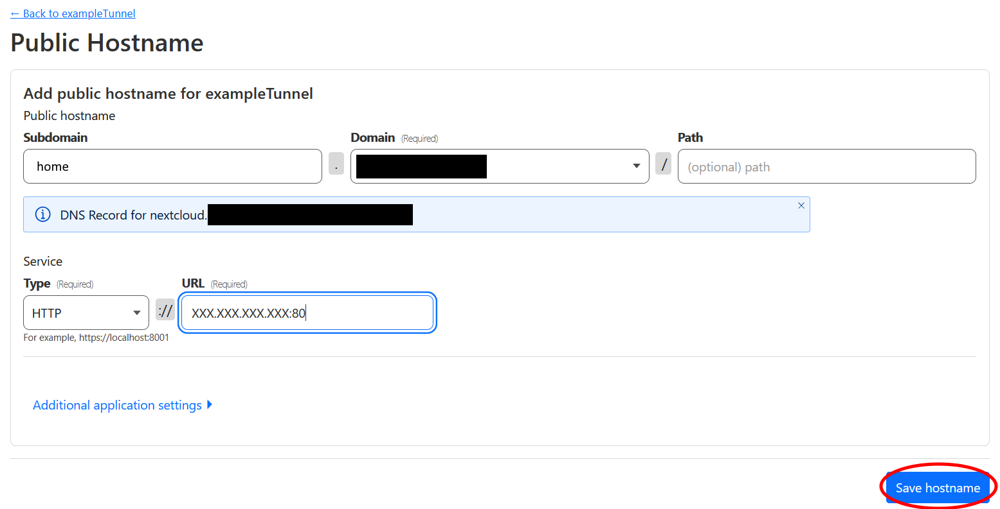

# __Cloudflared Tunnel Setup (Connecting Your Pi To The Worldwide Web)__

In this section you will install a Cloudflared tunnel. This well let you and others connect securely to your Hearth Box from the worldwide web.

*Author's Note: Tail Scale and Head Scale are programs which can be used in place of Cloudflare for this, removing even that reliance on a potentially untrusted service provide, and we intend to add tutorial options for them at a later date. However these programs are a bit more technically tricky to set up, and morever require technical effort on the part of everyone who wants to connect to your server beyond simply typing in a URL and logging on to your server, so they are not our focus at this time.* 

## __Installing Cloudflared__

Cloudflared (note the 'd') is a program which connects your server to a Cloudflare tunnel. This ensures that encrypted information always goes through Cloudflare, where it is properly encrypted and protected from eavesdroppers. [Here is an explanation, if you are curious.](https://developers.cloudflare.com/cloudflare-one/connections/connect-networks/)

1. If you do not already have it open, access your Raspberry Pi by entering its **local IP address** into your web browser. Open the `App Store` button. Navigate to the "Cloudflared" installer either by scrolling down, or typing `cloudlflared` into the search bar. Then click `Install`.

  

2. This should bring up the following installation window, which you can scroll to see the entirety of. Add your **Raspberry Pi's local IP address** to the leftmost text box under "Web UI". The click `Save`. This tells your server that you want to connect to this program via your local router, not the worldwide web. (You will only be able to access this program from a machine connected to your local router, but that's fine, you only need to use it once.

Leave this webpage open in the background during the next steps, you will be returning to it shortly.

## __Setting up a Cloudflare Tunnel__

Next, you will set up a "tunnel" through Cloudflare, for Cloudflared (note the 'd') to connect to. This ensures that encrypted information always goes through Cloudflare, where it is properly encrypted and protected from eavesdroppers. [An explanation, if you are curious.](https://developers.cloudflare.com/cloudflare-one/connections/connect-networks/)

3. If you still have Cloudflare's webpage open from previous steps, return to it. If not, open [Cloudflare's website](https://dash.cloudflare.com/) in a new browser tab or browser page. Return to Cloudflare's `Account Home`.

4. On the left-hand side of your screen, click `Zero Trust`. This will take you to a screen where you enter a team name. Enter whatever you want, you don't have to record this.

  

5. In the home page for `Zero Trust`, click `Networks`, then click `Create a tunnel`. Select `Cloudflared`. Enter a name for your tunnel and click `Save Tunnel`. You do not have to record this name - it will be here on your Cloudflare account if you ever need it again. Select `Docker`. Click the text which begins with `$ docker run`, or highlight and press `Ctrl + C` to *Copy* that text.

 

 

## __Connecting Your Cloudflare Tunnel to Cloudflared__

6. Return to the webpage from Step 1, where you accessed your Raspberry Pi by entering its **local IP address** into your web browser.

7. Click the `Cloudflared` program icon. This will open a new tab with your Cloudflared program. Click inside the text box beneath **Enter Tunnel Connector Token:". Then press `CTRL + V` (for Linux or Windows) or `CMD + V` (for Mac) to *Paste* the text from Step 5.

 

5. Press the `Save` button. It will turn into `Start` button. Press the `Start` button. Close out of the Cloudflared tab and delete `Cloudflared_Tunnel.txt`.

 

That's it! That's all you have to do with Cloudflared.

Note: If you ever move / get a new router, you may have to refresh your token. Do so by returning to the Tunnel page (see the [Cloudflare section](../Instructions/Cloudflare_(Web_URL).md)), clicking the **3 menu dots** next to your tunnel, clicking **Configure**, clicking **Docker**, and then clicking **Refresh Token**. Then copy the new token, as previously, and open Cloudflared. Press **Stop**, paste the new token, then press **Save** and then **Start**.

## __Setting Up Connections To Specific Programs__

6. Finally, return to the Cloudflare webpage, scroll down, and click `Next` at the bottom of the page. This will take you to the page pictured below.
  
**Note:** You will return to this page multiple times. Depending on what part of the process you're at, the `Save` button will either say `Save Tunnel` or `Save Hostname`.

What you do next depends on whether you are setting up a full home server or only a secure communications hub. Follow the instructions below based on your choice. Either way, this next step will set up a series of sub-websites which you will use to access various functions of your Raspberry Pi. For example, `databag.[exampleweburl].org` will take you to your secure communications hub. Meanwhile `nginx.[exampleweburl].org` will take you to part of your device's security interface, and `pihole.[exampleweburl].org` will take you to the control panel for an adblocker which will reduce the number of ads for all devices on your internet.

## __Full Home Server (includes Secure Communications)__

### __Raspberry Pi Homepage__

This will take you to your Raspberry Pi homepage, the same webpage you accessed in Step 1 by entering your **Raspberry Pi's local IP address**, but it will do so from anywhere in the world.

In the "subdomain" section, enter **nextcloud**. In the "domain" section, select your chosen URL from the drop-down list. Under "type" select `HTTP`. Under "URL", enter your **global IP address** followed by `:7580`. It should have the form: `XXX.XXX.XXX.XXX:7580`. Click `Save`. Then select your tunnel name to enter the next public hostname.

  

### __Nextcloud__

Once your system is set up, this URL will take you to your new cloud server, where you can back up and share files. This will incidentally host a secondary communication hub. 

In the "subdomain" section, enter **nextcloud**. In the "domain" section, select your chosen URL from the drop-down list. Under "type" select `HTTP`. Under "URL", enter your **global IP address** followed by `:7580`. It should have the form: `XXX.XXX.XXX.XXX:7580`. Click `Save`. Then select your tunnel name to enter the next public hostname.

  

### __Databag__

Once your system is set up, this URL will take you to your secure communication hub.

In the "subdomain" section, enter **databag**. In the "domain" section, select your chosen URL from the drop-down list. Under "type" select `HTTP`. Under "URL", enter your **global IP address** followed by `:7000`. It should have the form: `XXX.XXX.XXX.XXX:7000`. Click `Save`. Then select your tunnel name to enter the next public hostname.

  

### __Pihole__

Once your system is set up, this URL will take you to the control panel for an adblocker which will reduce the number of ads for all devices on your internet.

In the "subdomain" section, enter **pihole**. In the "domain" section, select your chosen URL from the drop-down list. Under "type" select `HTTP`. Under "URL", enter your **global IP address** followed by `:8080`. It should have the form: `XXX.XXX.XXX.XXX:8080`. Click `Save`. 

 

You are finished with Cloudflare! Hallelujah! Your next step will be to [image an operating system onto your Raspberry Pi](../Instructions/Raspberry_Pi_Image_Decision.md).

## __Secure Communications Only__

*Under construction. Please check back later!*

As a gentle introduction to CasaOS, you might want to set up an advertisement / tracker blocker, called Pi-hole, which will block many ads you might otherwise see while browsing the internet. [Click here to install Pi-hole](../Instructions/Pi-hole_Installation.md).

If you want to skip that, you can go straight to installing a [secure communications system and home cloud server using Nextcloud](../Instructions/Nextcloud_Setup_Local.md).

If you want to skip that, you can go straight to installing a [dedicated secure communications system](../Instructions/Databag_Setup_Local.md).
