# __Nextcloud Setup__

In this section you will install Nextloud. This well let you and others securely communicate to each other over the worldwide web through text, voice, and video chats. It will also act as a cloud storage device, allowing you and others to save files online and synchronize them through devices.

## __Installing Nextcloud__


1. If you do not already have it open, access your Raspberry Pi by entering `home.[exampleweburl]` into your web browser, where `exampleWebURL` corresponds to your chosen **Web URL**, including the ".com", ".org", etc suffix on the end. Open the `App Store` button. Navigate to the "Nextcloud" installer with the "BigBearCasaOS tag beneath it, either by scrolling down, or typing `nextcloud` into the search bar. Then click `Install`.

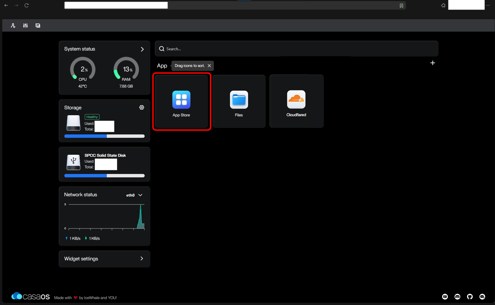 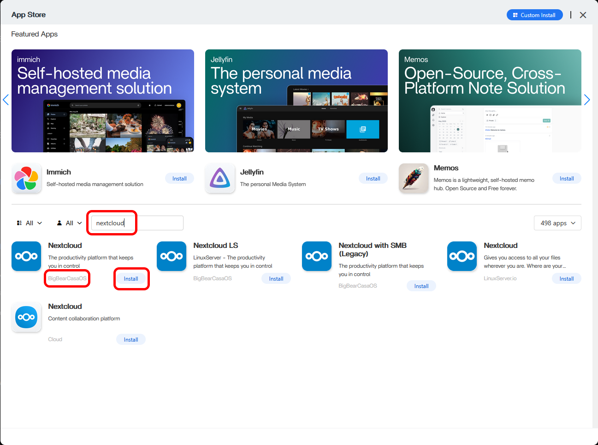 

2. This should bring up the following installation window, which you can scroll to see the entirety of. If it does not, scroll over the "Nextcloud" App and click the three dots which appear, then click `Settings`. There will be four tabs at the top of the Settings screen: cron, db-nextcloud, nextcloud, and redis-nextcloud. You will need to add, change, or confirm information on three of those tabs: cron, db-nextcloud, and nextcloud.

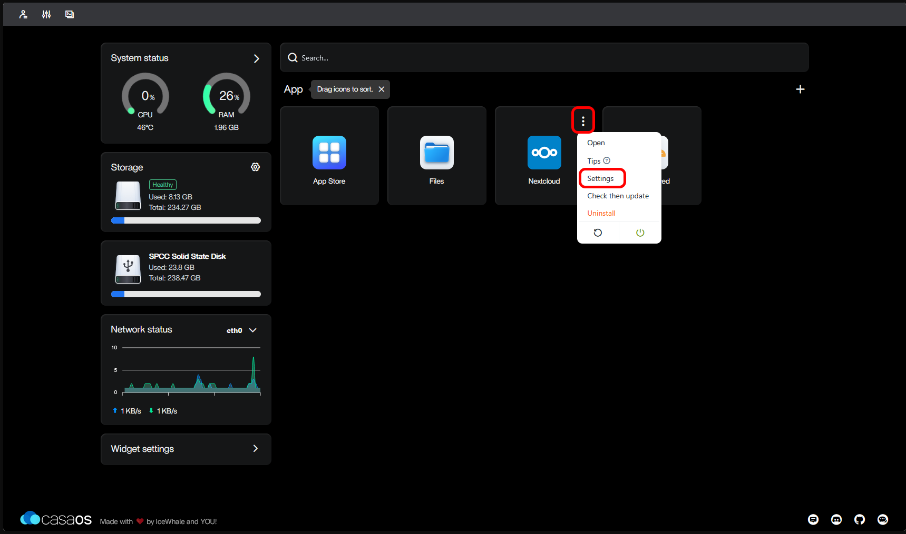

3. If you are not already on it, click the `cron` tab in the "Settings" window. ([Cron](https://en.wikipedia.org/wiki/Cron#) is a program used for scheduling automated repetitive tasks on a Linux operating system, like the one installed on your Raspberry Pi.) The below doesn't have anything to do with Cron details though, it just happens to be the first settings tab, which is where CasaOS puts the "Web UI" settings for a program - which is used to tell your Raspberry Pi how to open an app when you click on it from the homepage. 
  - Under "Web UI", use the drop-down menu to make sure the URL prefix is `https://`. This ensures that when you click the Nextcloud icon from your homepage, it uses a secure connection.
  - Under "Web UI", enter `nextcloud.[exampleURL]` into the first box after the prefix, where `exampleURL` corresponds to your chosen **Web URL**, including the ".com", ".org", etc suffix on the end.
  - Under "Web UI", delete everything in the second box after the prefix. Once you have done so, it should read ":Ports", where that text is greyed out.
  - Under "Web UI", make sure the third box after the prefix contains only a `/` symbol.


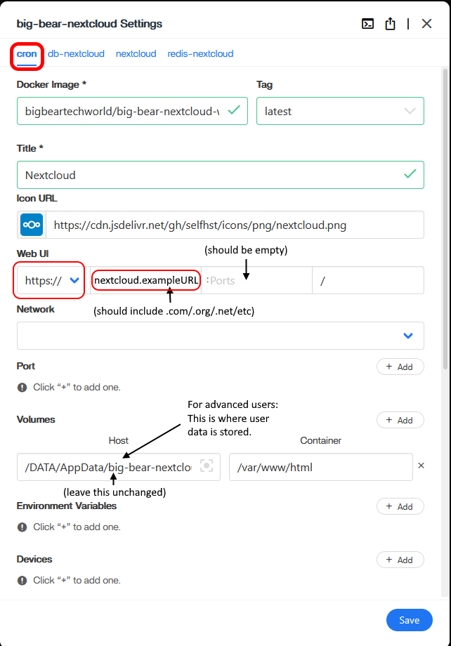 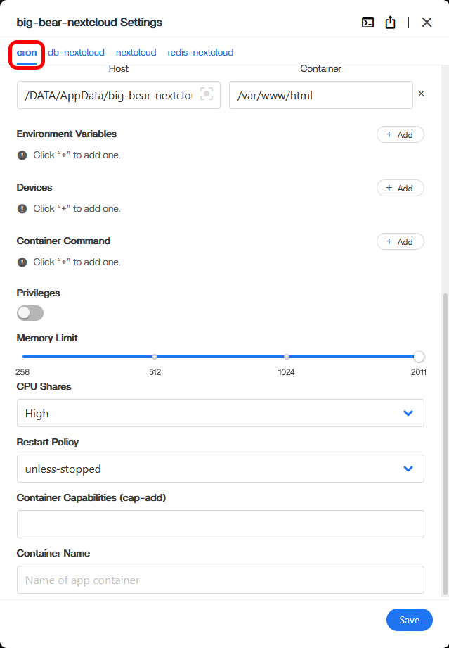 

4. Click the `db-nextcloud` tab in the "Settings" window. This tab controls backend settings for PostgresSQL, a database management program which helps Nextcloud. You need to change the following setting for security reasons, but you will never use them unless you are a very advanced user.
  - Under "Environment Variables", there are columns labeled "Key" and "Value". Next to the key labeled "POSTGRES_PASSWORD", change the text in the value box to be a random sequence of letters and numbers like this "fsaDfstTEW4573KNWEnfk" (DO NOT USE THIS SPECIFIC SEQUENCE). You don't need to write this down or be able to remember it, it just needs to be random and long so bad actors can't have a program guess it.

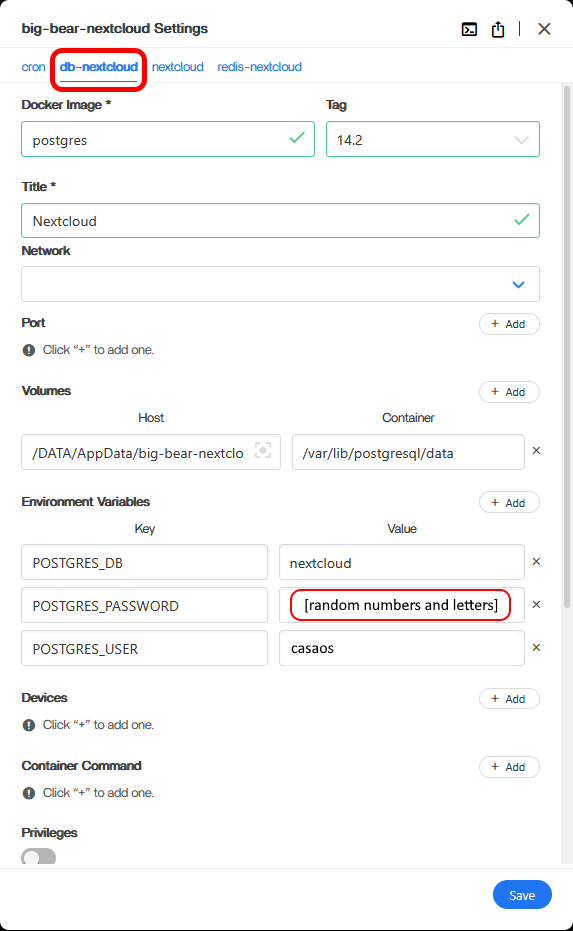 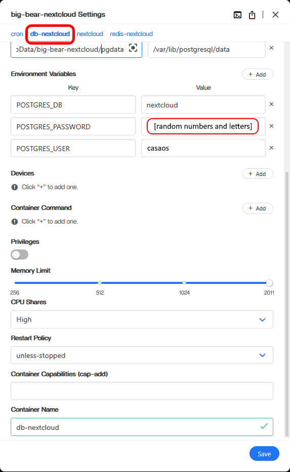 

5. Click the `nextcloud` tab in the "Settings" window. This tab controls backend settings for the Nextcloud program itself.
  - Under "Environment Variables", there are columns labeled "Key" and "Value". Next to the key labeled "OVERWRITEPROTOCOL", change the value to `https`, if it isn't that already. This ensures your Nextcloud program only uses secure communication protocols for transferring information.
  - Under "Environment Variables", there are columns labeled "Key" and "Value". Next to the key labeled "PHP_MEMORY_LIMIT", change the value to "1024M". This increases the size limit of the 'chunks' Nextcloud uses to send large files, improving transfer speeds.
  - Under "Environment Variables", there are columns labeled "Key" and "Value". Next to the key labeled "PHP_UPLOAD_LIMIT", change the value to "1024M". This increases the size limit of the 'chunks' Nextcloud uses to send large files, improving transfer speeds.
  - Under "Environment Variables", there are columns labeled "Key" and "Value". Next to the key labeled "POSTGRES_PASSWORD", change the text in the value box to be the same random sequence of letters and numbers as in step 4 above.

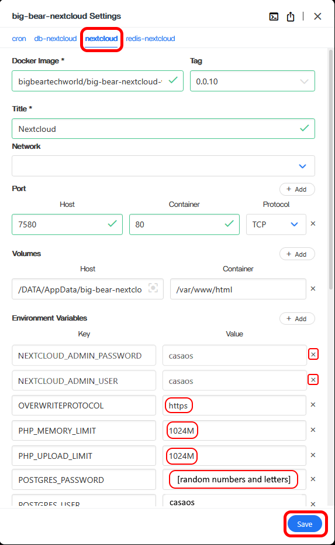 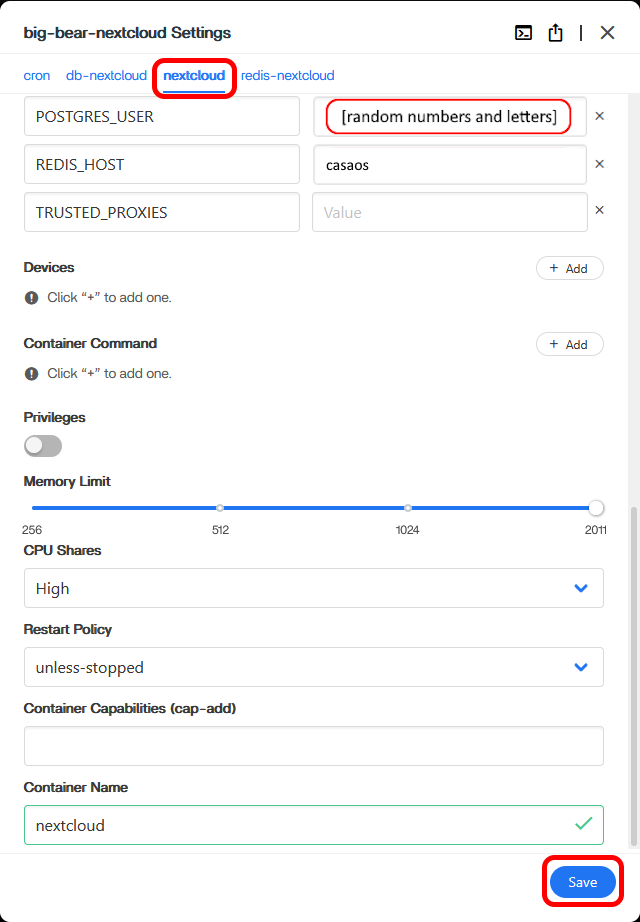 

6. Press `Save` to confirm these settings. Wait for Nextcloud to finish changing itself to include the new settings (there will be a message telling you when this is done).

7. Click the `Files` app on the homepage. Then click the following files in order: `AppData` > `big-bear-nextcloud` > `html` > `config`. Then click the file named `config.php`. This opens a file containing settings which control how Nextcloud functions. You will need to change some preexisting settings, and add new ones.

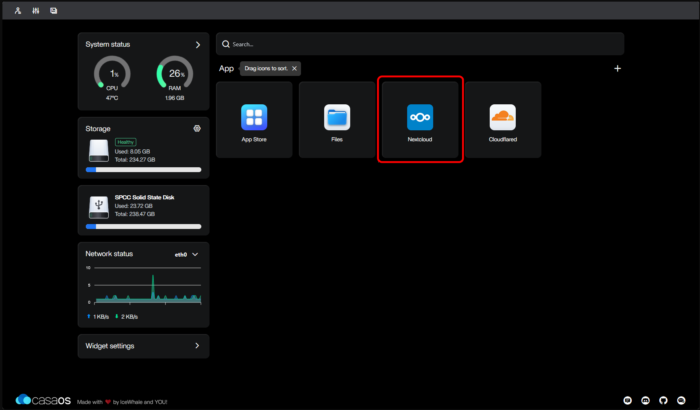 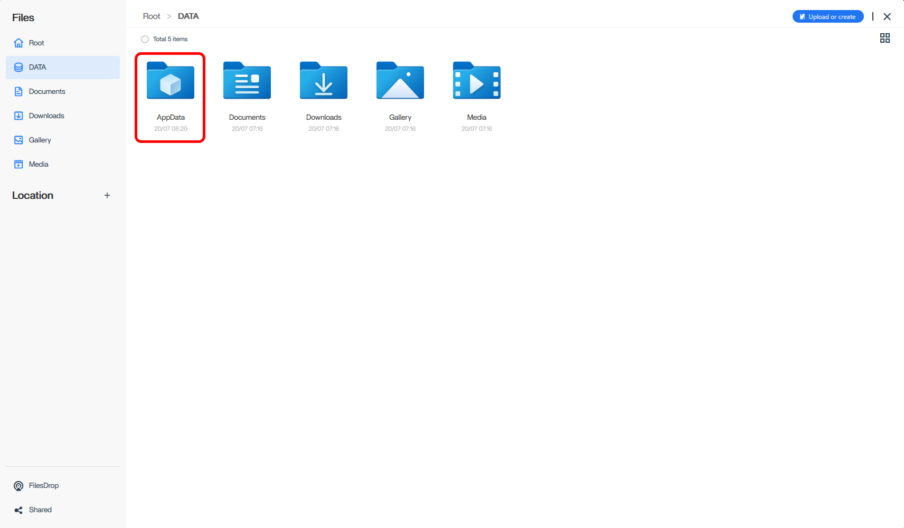 
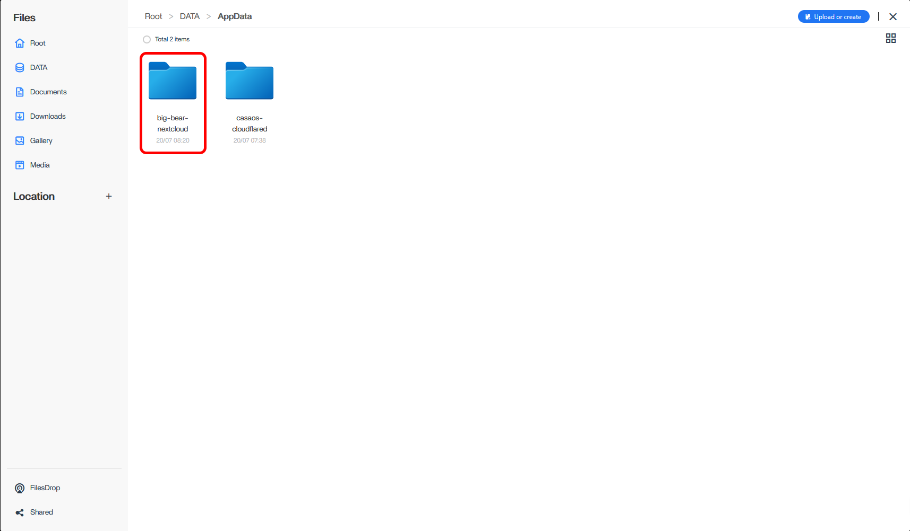 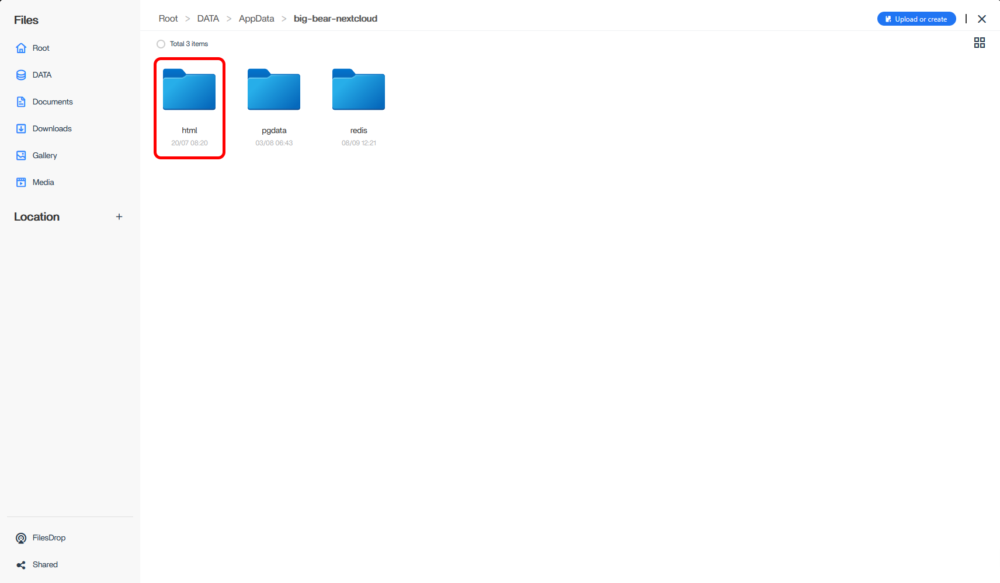 
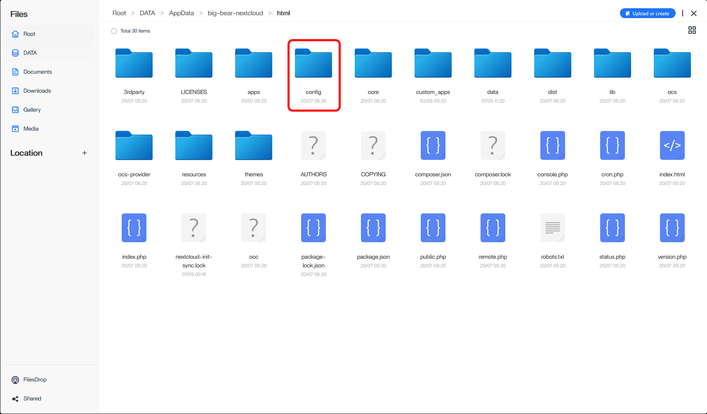 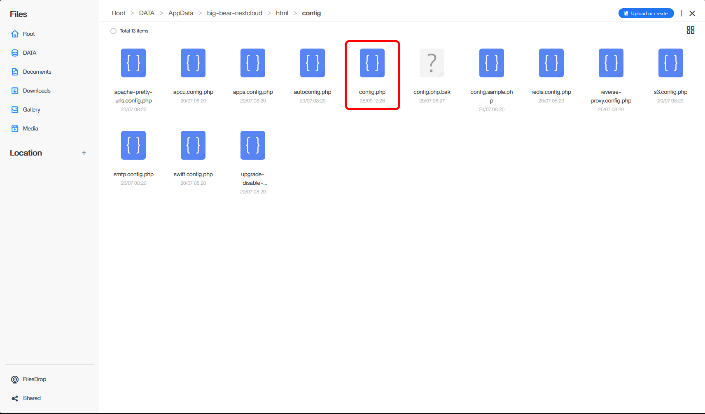 

8. First we will add two settings. Normally Nextcloud is excessively careful with how it handles files, which is useful for a professional company server, but not useful for personal use. Adding these settings turns that off.

Copy the text below (including the empty line) by selecting it and pressing `ctrl+c`. Now return to the `config.php` file from the previous step. Move your cursor, using `mouse clicks` or the `arrows keys`, to be immediately after the very last comma of the file. Now press `ctrl+v` to paste the copied code. It should now look like the images below. 

```

  'maintenance' => false,
  'filelocking.enabled' => false,
```

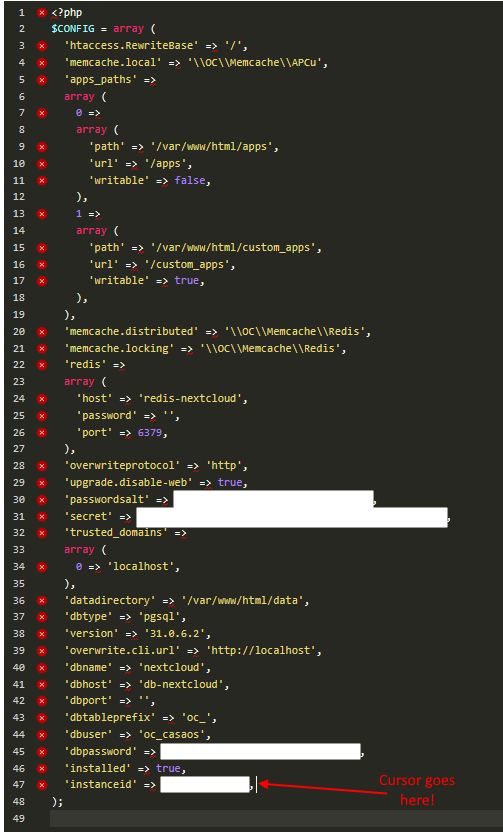 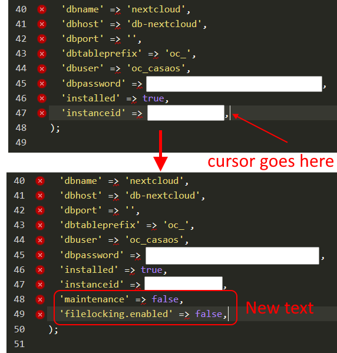 

9. Next, find the line which says "'overwriteprotocol' => 'http',". Navigate to it and type an `s` to change it to `'overwriteprotocol' => 'https',`. This ensures Nextcloud always uses secure encryption protocols to transfer information.

Leave the values for "NEXTCLOUD_ADMIN_PASSWORD" and "NEXTCLOUD_ADMIN_USER" as `casaos` and `casaos`. 

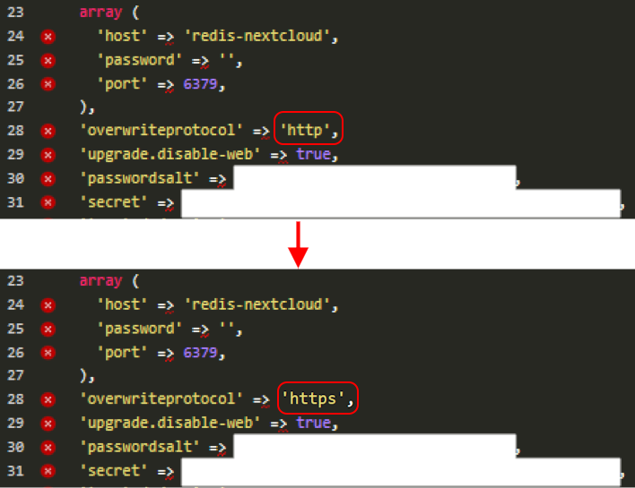 

10. Finally, find the section underneath "'trusted_domains' =>". You need to add two things to the section below it, which will tell Nextcloud to recognize communications coming from your Raspberry Pi and from your Web URL as legitimate communications. Using your keyboard, add two new lines beneath the line saying "0 => 'localhost',". Don't forget to include the preceding four empty spaces `    `, the single quotation marks `'`, or the commas `,`.

For the first line, replace everything inside the square brackets (including the brackets) with your **Raspberry Pi's local IP address**. For the second line, replace everything inside the square brackets (including the brackets) with your chosen **Web URL**, including the ".com", ".org", etc suffix on the end.

```    1 => '[Your Raspberry Pi's local IP address]',```

```    2 => 'network.[examplewebURL]',```

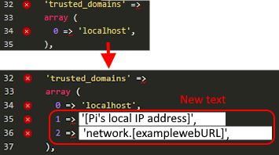 

11. Press the `X` button to close out the file system. Then click the `Nextcloud` app on your homepage to open Nextcloud.

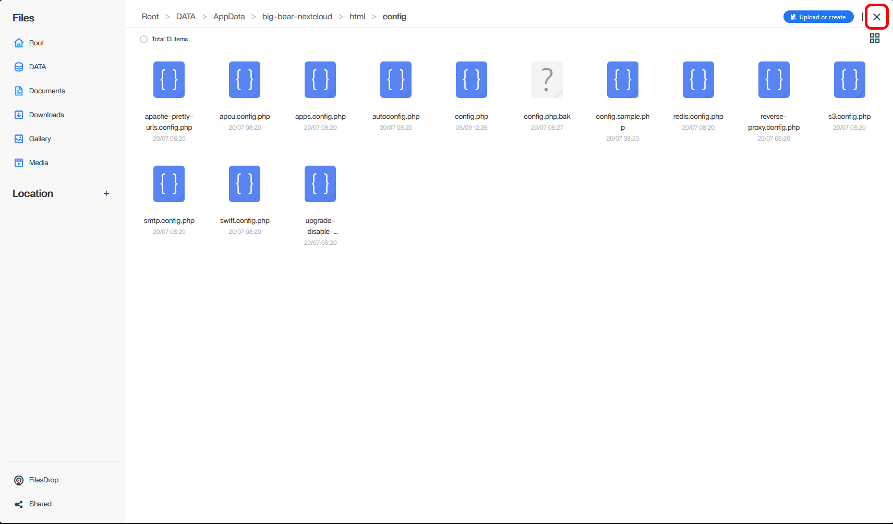 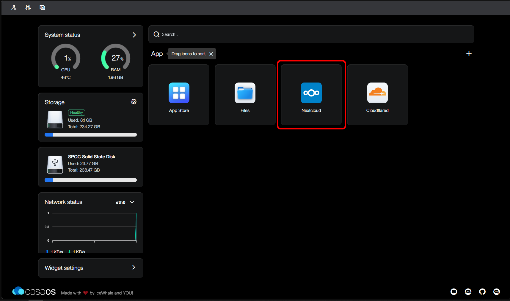 
