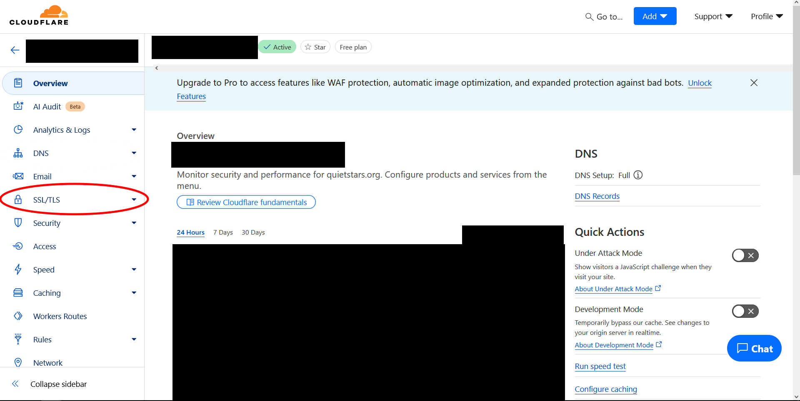
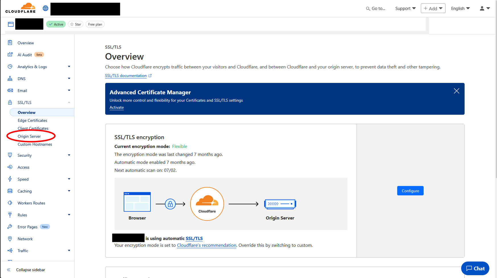
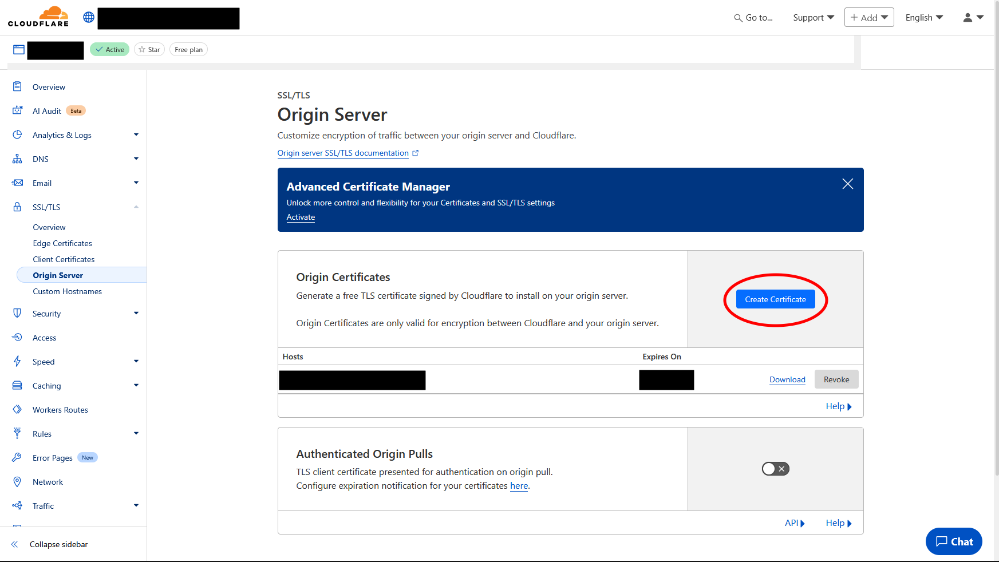
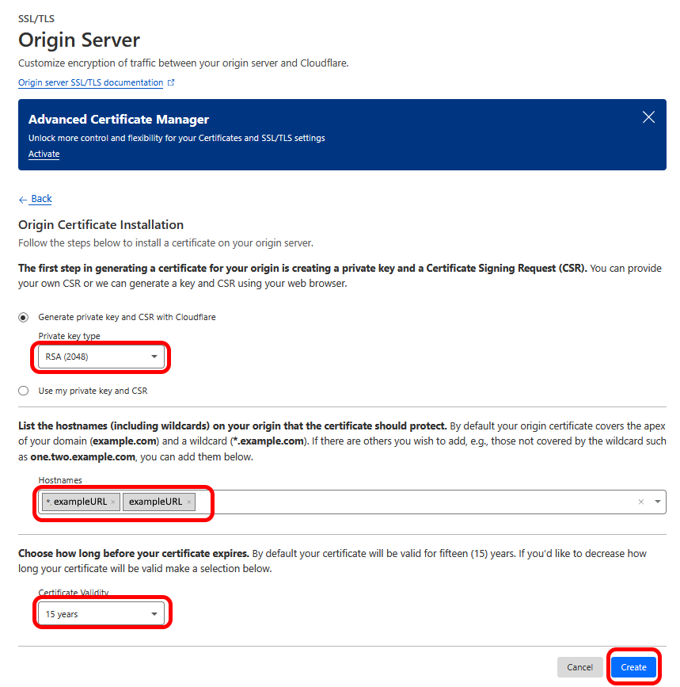
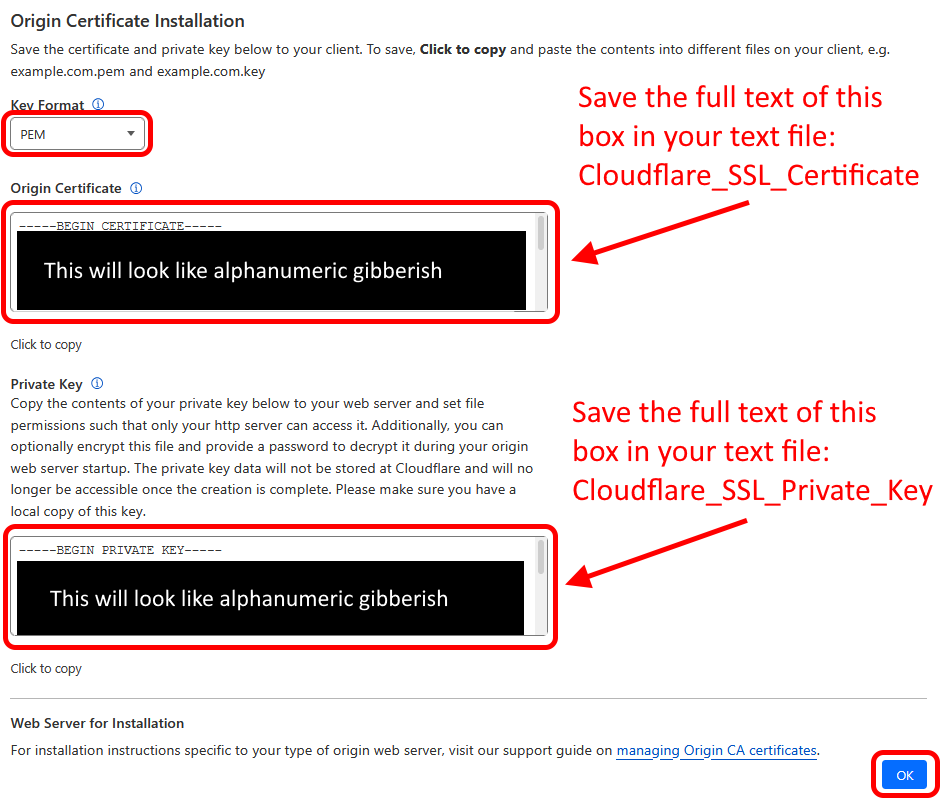

## __Obtaining an SSL Certificate and Private Key__

Next you will obtain a "Secure Sockets Layer" (SSL) certificate and SSL private key. Encrypted communication requires a server to have a "private key" (a string of random characters) from which "public keys" are created and given to machines which connect to the server. These keys are used to perform encryption ([an explanation, if you are curious](https://en.wikipedia.org/wiki/Public-key_cryptography)). To ensure no one impersonates your server, your private key must be verified by a trusted authority (in this case, Cloudlfare). This verification is managed by an SSL certificate ([an explanation, if you are curious](https://www.cloudflare.com/learning/ssl/what-is-an-ssl-certificate/)).

5. Return to Cloudflare's `Account Home`. Click your chosen URL under `Domain`. Click the `SSL` (Secure Sockets Layer) tab on the left, then the `Origin Server` tab beneath that.

   

6. Click `Create Certificate`. You shouldn't have to change anything on the next page, but check that the "Private Key Type" = `RSA (2048)`, that "Hostnames" has two values of the form `*.exampleURL` and `exampleURL`, and that "Certificate Validity" is set to `15 years`. Then click `Create`. On the next page, check that "Key Format" = `PEM`. 

  

(This image below applies to steps 7, 8, and 9.)

 

8. Before beginning you should have created a text file named `Cloudflare_SSL_Certificate.txt` . Open it. Navigate back to your browser and click on the text in "Origin Box" to select it, then press `Ctrl + C` to *Copy* that text. Then select your text file (you may have to click the body of the file to select it properly) and press `CTRL + V` (for Linux or Windows) or `CMD + V` (for Mac) to *Paste* the text you copied in previous step into the file. Save this file and leave the folder it is within open.

9. Before beginning you should have created a text file named `Cloudflare_SSL_private Key.txt` . Open it. Navigate back to your browser and click on the text in "Private Key" to select it, then press `Ctrl + C` to *Copy* that text. Then select your text file (you may have to click the body of the file to select it properly) and press `CTRL + V` (for Linux or Windows) or `CMD + V` (for Mac) to *Paste* the text you copied in previous step into the file. Save this file and leave the folder it is within open.

We will use these files later.
